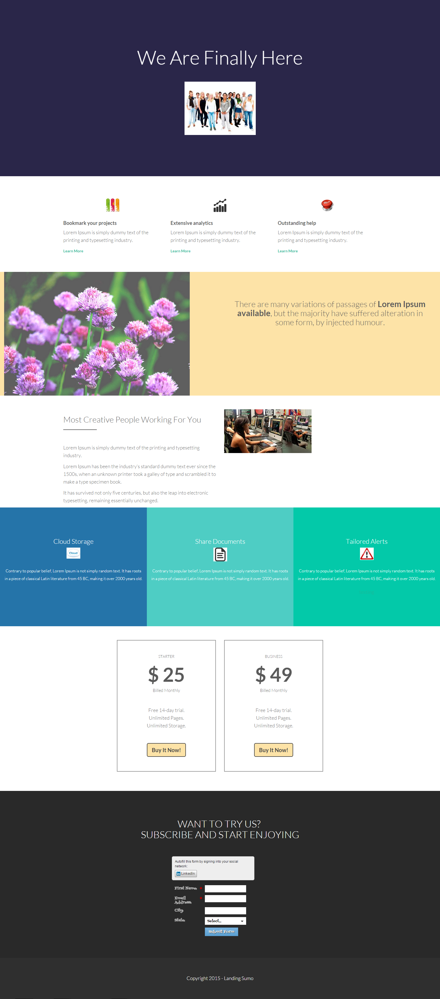

# 模板 13A {#template-13a}

右键单击以[下载模板13A](https://experienceleague.adobe.com/landing/marketo/lp-templates/template-13a.html)

此模板包括以下内容：

* 主分区

   * 包括主页标题和图像

* 五个正文部分（可选）
* 页脚（可选）

**右键单击以下内容以下载此模板：**

[模板13A.html](https://experienceleague.adobe.com/landing/marketo/lp-templates/template-13a.html)
