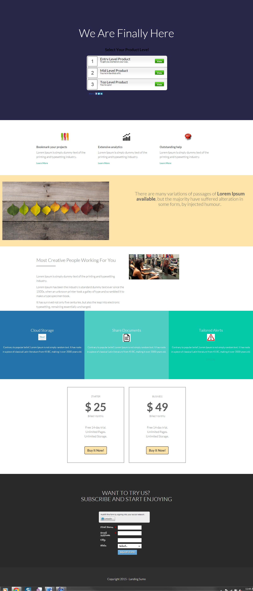

# 模板 13C {#template-13c}

右键单击以[下载模板13C](https://experienceleague.adobe.com/landing/marketo/lp-templates/template-13c.html?lang=zh-Hans)

此模板包括以下内容：

* 主分区

   * 包含主页标题和投票

* 五个正文部分（可选）
* 页脚（可选）

**右键单击以下内容以下载此模板：**

[Template13C.html](https://experienceleague.adobe.com/landing/marketo/lp-templates/template-13c.html?lang=zh-Hans)
