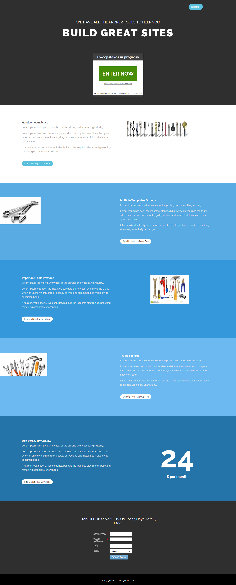

# 模板 15D {#template-15d}

右键单击[下载模板15D](https://51837-micrositemarketo.adobeio-static.net/lp-templates/template-15d.html)并选择&#x200B;**将链接另存为……**

>[!NOTE]
>
>有关如何下载和导入模板[的完整步骤，请参阅此处](/help/marketo/product-docs/demand-generation/landing-pages/landing-page-templates/guided-landing-page-template-list.md#how-to-import){target="_blank"}。

此模板包括以下内容：

* 主分区

  * 包括主页标题、主页抽奖和注册按钮

* 五个正文部分（可选）
* 页脚（可选）

**右键单击下方（并选择&#x200B;_链接另存为……_） 要下载此模板，请执行以下操作：**

[模板15D.html](https://51837-micrositemarketo.adobeio-static.net/lp-templates/template-15d.html)
