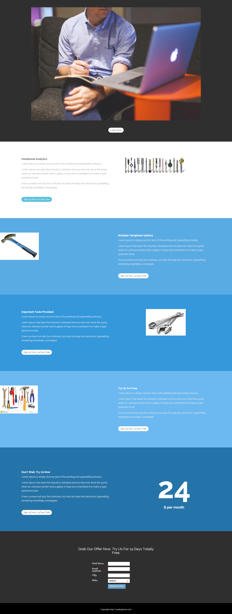

# 模板15E {#template-15e}

右键单击 [下载模板15E](https://experienceleague.adobe.com/landing/marketo/lp-templates/template-15e.html)

此模板包括以下内容：

* 主分区

   * 包括一个主页图像和“了解详情”按钮

* 五个正文部分（可选）
* 页脚（可选）

**右键单击以下内容以下载此模板：**

[模板15E.html](https://experienceleague.adobe.com/landing/marketo/lp-templates/template-15e.html)
