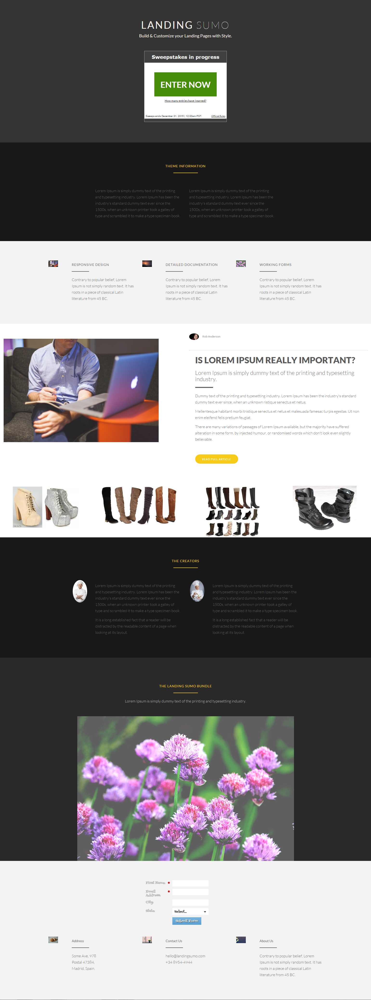

# 模板19D {#template-19d}

[下载模板19D](https://experienceleague.adobe.com/landing/marketo/lp-templates/template-19d.html)

此模板包含以下内容：

* 主要部分

   * 包括主页标题、主页文本和抽奖

* 五个正文部分（可选）
* 页脚（可选）

**单击下面的可下载此模板：**

[模板19D.html](https://experienceleague.adobe.com/landing/marketo/lp-templates/template-19d.html)
