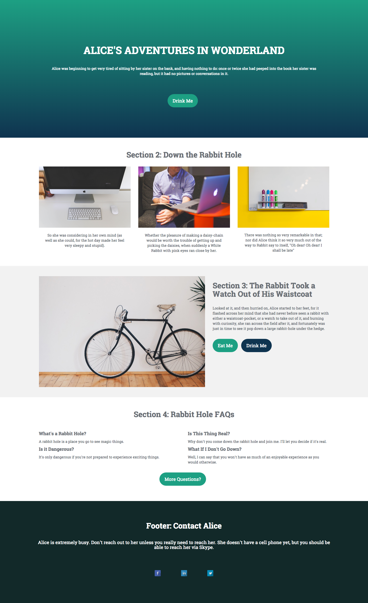

# 模板1E {#template-1e}

右键单击 [下载模板1E](https://experienceleague.adobe.com/landing/marketo/lp-templates/template-1e.html)

此模板包含以下内容：

* 主分区

   * 包括标题、正文文本和按钮。

* 三个正文部分（可选）
* 页脚（可选）

**右键单击以下内容可下载此模板：**

[模板1E.html](https://experienceleague.adobe.com/landing/marketo/lp-templates/template-1e.html)
