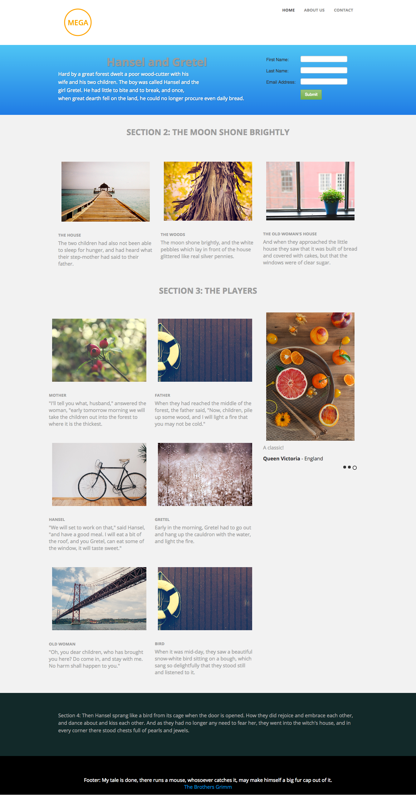

# 模板3A {#template-3a}

右键单击 [下载模板3A](https://experienceleague.adobe.com/landing/marketo/lp-templates/template-3a.html)

此模板包括以下内容：

* 带徽标和3个按钮的页眉（可选）
* 主分区

   * 包括主页文本和表单。

* 三个正文部分（可选）
* 页脚（可选）

**右键单击以下内容以下载此模板：**

[模板3A.html](https://experienceleague.adobe.com/landing/marketo/lp-templates/template-3a.html)
