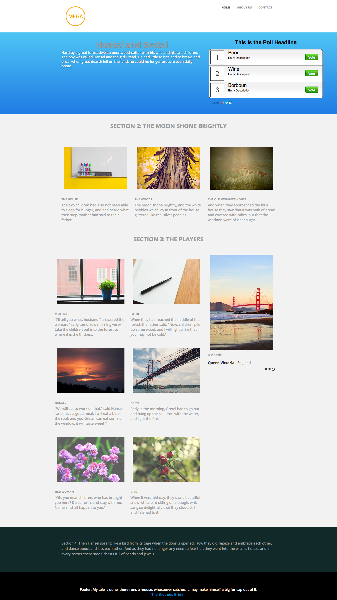

# 模板 3C {#template-3c}

右键单击以[下载模板3C](https://experienceleague.adobe.com/landing/marketo/lp-templates/template-3c.html?lang=zh-Hans)

此模板包括以下内容：

* 带徽标和3个按钮的页眉（可选）
* 主分区

   * 包括主页文本和投票。

* 三个正文部分（可选）
* 页脚（可选）

**右键单击以下内容以下载此模板：**

[模板3C.html](https://experienceleague.adobe.com/landing/marketo/lp-templates/template-3c.html?lang=zh-Hans)
