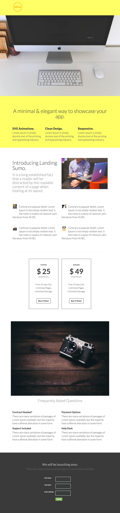

# 模板5-A {#template-a}

[下载Template-5A](https://docs.marketo.com/download/attachments/8162243/template-5a.html?version=1&amp;modificationdate=1437692717000&amp;api=v2)

此模板包含以下内容：

* 标题（可选）
* 主要部分

   * 包括人物图像、人物标题和3个描述项目符号。

* 三个正文部分（可选）
* 页脚（可选）

**单击下面以下载此模板：**

[Template-5A.html](https://docs.marketo.com/download/attachments/8162243/template-5a.html?version=1&amp;modificationdate=1437692717000&amp;api=v2)
