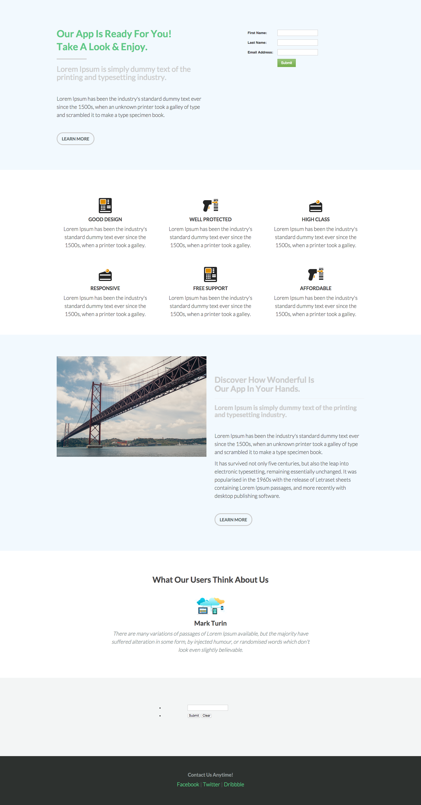

# 模板6B {#template-6b}

右键单击 [下载模板6B](https://experienceleague.adobe.com/landing/marketo/lp-templates/template-6b.html)

此模板包含以下内容：

* 主分区

   * 包括主页表单、标题、字幕、正文和按钮。

* 四个主体部分（可选）
* 页脚（可选）

**右键单击以下内容可下载此模板：**

[模板6B.html](https://experienceleague.adobe.com/landing/marketo/lp-templates/template-6b.html)
