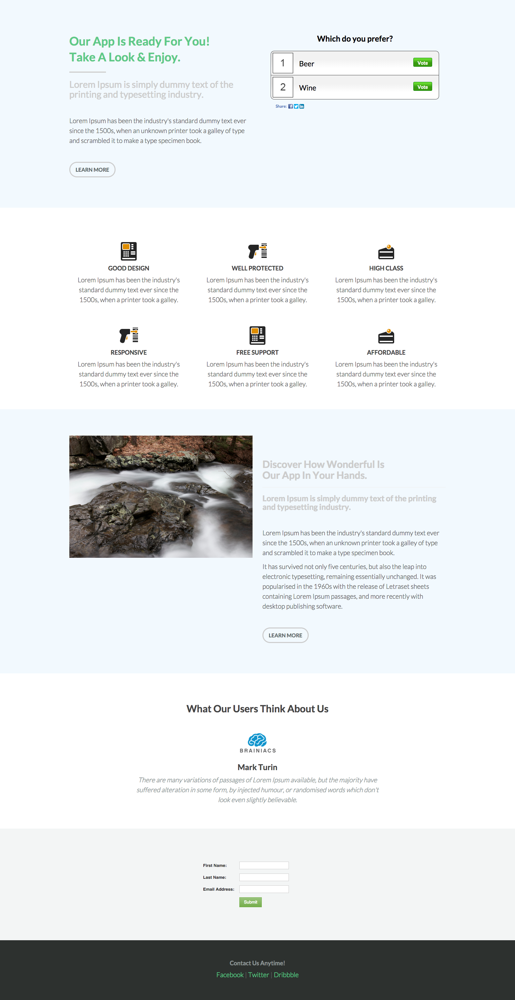

# 模板6C {#template-6c}

[下载模板6C](https://experienceleague.adobe.com/landing/marketo/lp-templates/template-6c.html)

此模板包含以下内容：

* 主要部分

   * 包括主页投票、标题、子标题、正文文本和按钮。

* 四个正文部分（可选）
* 页脚（可选）

**单击下面的可下载此模板：**

[模板6C.html](https://experienceleague.adobe.com/landing/marketo/lp-templates/template-6c.html)
