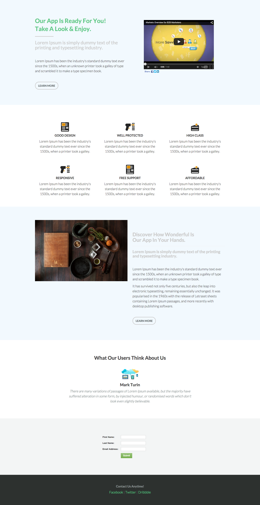

# 模板 6D {#template-6d}

右键单击以[下载模板6D](https://experienceleague.adobe.com/landing/marketo/lp-templates/template-6d.html)

此模板包括以下内容：

* 主分区

   * 包括主页视频、标题、子标题、正文和按钮。

* 四个主体部分（可选）
* 页脚（可选）

**右键单击以下内容以下载此模板：**

[模板6D.html](https://experienceleague.adobe.com/landing/marketo/lp-templates/template-6d.html)
