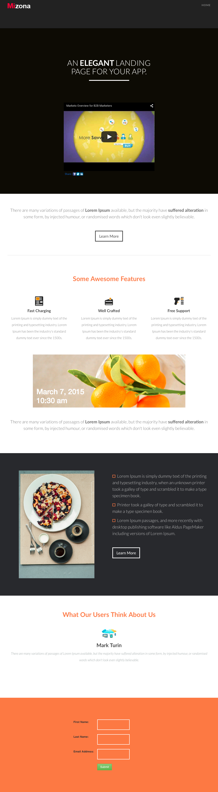

# 模板 7B {#template-7b}

右键单击以[下载模板7B](https://51837-micrositemarketo.adobeio-static.net/lp-templates/template-7b.html)

此模板包括以下内容：

* 标题（可选）
* 主分区

  * 包括标题和视频

* 四个主体部分（可选）
* 页脚（可选）

**右键单击以下内容以下载此模板：**

[模板7B.html](https://51837-micrositemarketo.adobeio-static.net/lp-templates/template-7b.html)
