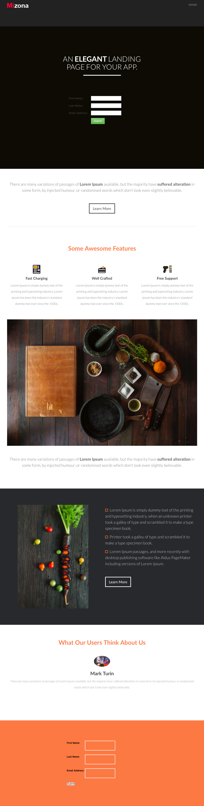

# 模板 7D {#template-7d}

右键单击以[下载模板7D](https://experienceleague.adobe.com/landing/marketo/lp-templates/template-7d.html)

此模板包括以下内容：

* 标题（可选）
* 主分区

   * 包含标题和表单

* 四个主体部分（可选）
* 页脚（可选）

**右键单击以下内容以下载此模板：**

[模板7D.html](https://experienceleague.adobe.com/landing/marketo/lp-templates/template-7d.html)
