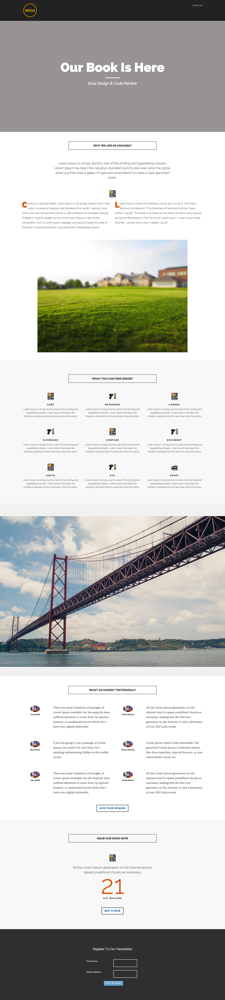

# 模板8A {#template-8a}

右键单击 [下载模板8A](https://experienceleague.adobe.com/landing/marketo/lp-templates/template-8a.html)

此模板包含以下内容：

* 标题（可选）
* 主要部分

   * 包含主页标题和主页文本

* 五个正文部分（可选）
* 页脚（可选）

**右键单击下面的可下载此模板：**

[模板8A.html](https://experienceleague.adobe.com/landing/marketo/lp-templates/template-8a.html)
