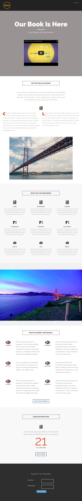

# 模板8C {#template-8c}

右键单击 [下载模板8C](https://experienceleague.adobe.com/landing/marketo/lp-templates/template-8c.html)

此模板包括以下内容：

* 标题（可选）
* 主分区

   * 包括主页标题、主页文本和视频

* 五个正文部分（可选）
* 页脚（可选）

**右键单击以下内容以下载此模板：**

[模板8C.html](https://experienceleague.adobe.com/landing/marketo/lp-templates/template-8c.html)
