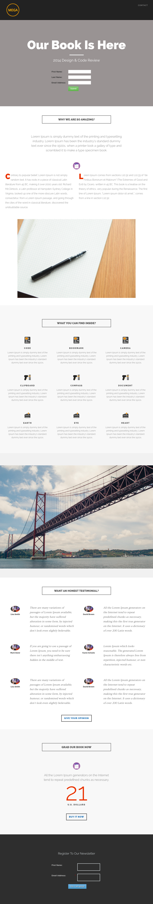

# 模板8E {#template-8e}

右键单击[下载Template 8E](https://experienceleague.adobe.com/landing/marketo/lp-templates/template-8e.html)

此模板包含以下内容：

* 标题（可选）
* 主要部分

   * 包括主页标题、主页文本和表单

* 五个正文部分（可选）
* 页脚（可选）

**右键单击下面的可下载此模板：**

[模板8E.html](https://experienceleague.adobe.com/landing/marketo/lp-templates/template-8e.html)
