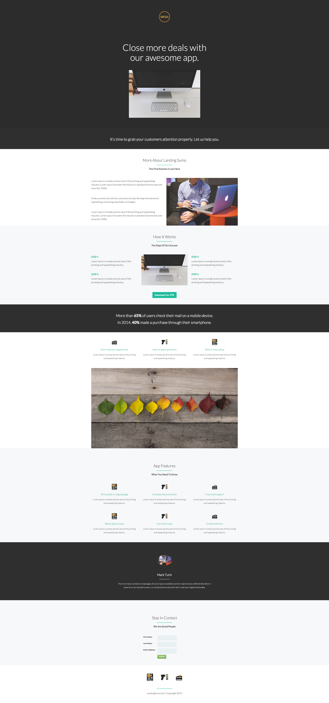

# 模板9-B {#template-b}

[下载模板9-B](https://docs.marketo.com/download/attachments/8783984/template-9b.html?version=2&amp;modificationdate=1438210694000&amp;api=v2)

此模板包含以下内容：

* 主要部分

   * 包括徽标图像、主页标题和主页图像

* 八个正文部分（可选）
* 页脚（可选）

**单击下面的可下载此模板：**

[Template9-B.html](https://docs.marketo.com/download/attachments/8783984/template-9b.html?version=2&amp;modificationdate=1438210694000&amp;api=v2)
