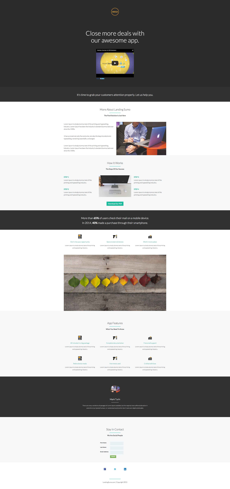

# 模板 9C {#template-9c}

右键单击以[下载模板9C](https://experienceleague.adobe.com/landing/marketo/lp-templates/template-9c.html)

此模板包括以下内容：

* 主分区

   * 包括徽标图像、视频和主页标题

* 八个身体部分（可选）
* 页脚（可选）

**右键单击以下内容以下载此模板：**

[模板9C.html](https://experienceleague.adobe.com/landing/marketo/lp-templates/template-9c.html)
