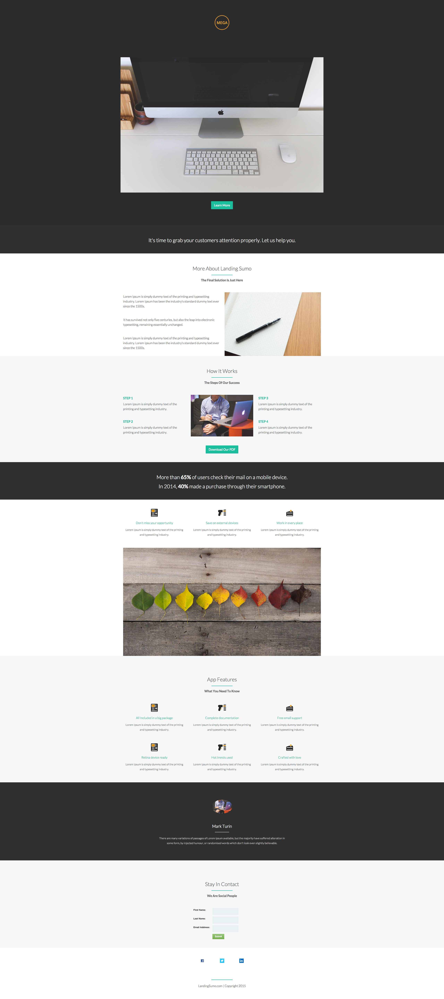

# 模板9-E {#template-e}

[下载模板9-E](https://docs.marketo.com/download/attachments/8783993/template-9e.html?version=2&amp;modificationdate=1438210788000&amp;api=v2)

此模板包含以下内容：

* 主要部分

   * 包括主页图像、徽标图像和按钮

* 八个正文部分（可选）
* 页脚（可选）

**单击下面的可下载此模板：**

[Template9-E.html](https://docs.marketo.com/download/attachments/8783993/template-9e.html?version=2&amp;modificationdate=1438210788000&amp;api=v2)
