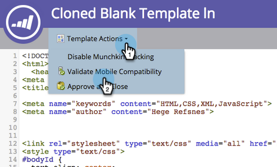
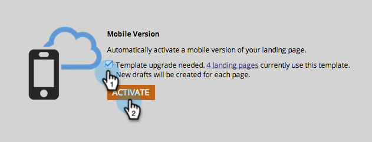

# 使现有的自由表单登陆页面模板与移动设备兼容 {#make-an-existing-free-form-landing-page-template-mobile-compatible}

可以在模板编辑器和登陆页面编辑器这两个位置执行此操作。

## 从模板编辑器升级 {#upgrade-from-the-template-editor}

1. 转到 **Design Studio**.

   

1. 选择 **模板**.

   

1. 选择模板，其中 **移动设备兼容** 是 **否**.

   

1. 单击 **编辑草稿**.

   

1. 单击 **使移动设备兼容**.

   

1. 单击 **升级**.

   

   您的登陆页面模板现在与移动设备兼容！

   >[!NOTE]
   >
   >升级应该无害，但请确保检查页面是否有任何差异。 升级将使用该模板创建任何登陆页面的草稿。

   

## 是什么使模板移动设备兼容？ {#what-makes-a-template-mobile-compatible}

好问题！ 您的模板必须具有以下标记：

`<pre data-theme="Confluence">Must have <!DOCTYPE HTML> Must have a <HEAD> element Must have a <TITLE> in the <HEAD> element Must have <META CHARSET="UTF-8"> within the <HEAD> element Must have a <BODY> element that contains one (and only one) 

</pre>`

如果一切正常，您将看到此消息。

如果出现错误，将显示一条错误消息，请单击“修复”以修复问题并重复验证过程。

如果对模板进行了任何更改，请单击模板操作，然后选择验证移动设备兼容性。

## 从自由格式登陆页面编辑器升级模板 {#upgrading-a-template-from-the-free-form-landing-page-editor}

在编辑登陆页并单击移动设备选项卡时，您有时会注意到模板尚未升级。 不要害怕！ 你可以在这里升级它。

1. 单击 **移动设备** 选项卡。

   

1. 单击该复选框，然后单击 **激活**.

   

   >[!NOTE]
   >
   >激活模板的移动版本将会创建使用该模板的任何登陆页面的草稿。

太棒了！ 您现在可以 [自定义移动设备视图](/help/marketo/product-docs/demand-generation/landing-pages/free-form-landing-pages/customize-mobile-view-for-your-free-form-landing-page.md) 您所有使用此模板的登陆页面的ID。
