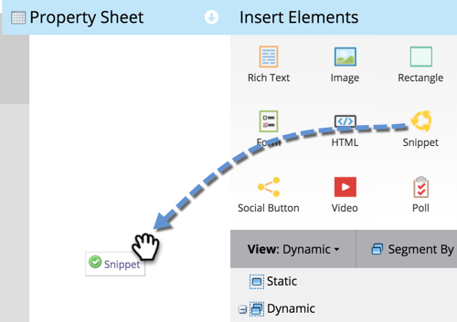

# 将代码片断添加到登陆页{#add-a-snippet-to-a-landing-page}

代码片段是少量HTML，可遵循规则并包含个性化内容。

>[!PREREQUISITES]
>
>[创建代码片断](/help/marketo/product-docs/personalization/segmentation-and-snippets/snippets/create-a-snippet.md)

1. 选择您的登陆页，然后单击“编辑草稿&#x200B;**”。**

   

1. 在登陆页编辑器中，拖动到&#x200B;**Snippet**&#x200B;元素上。

   

1. 找到您的代码片断，选择它，然后单击&#x200B;**保存**。

   

   >[!TIP]
   >
   >如果找不到您的代码片断，请确保它首先获得批准。

   >[!NOTE]
   >
   >如果要向引导式登陆页添加片段，请参阅[本文](/help/marketo/product-docs/demand-generation/landing-pages/landing-page-templates/create-a-guided-landing-page-template.md)。

太棒了！ 现在您了解如何向登陆页添加片段。
