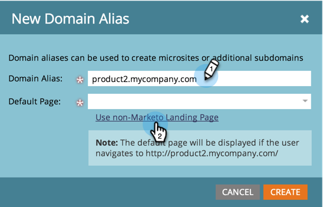

# 添加其他登陆页面CNAME {#add-additional-landing-page-cnames}

您可能需要添加登陆页面CNAME，以允许其他URL指向您的Marketo登陆页面。 执行以下步骤将帮助您管理多个域。

>[!CAUTION]
>
>Cookie无法跨域共享。

>[!TIP]
>
>**相同顶级域 — 好！ Cookie已共享**.  **转到**.mycompany.com > **信息**.mycompany.com
>
>**不同的顶级域 — 错误！ Cookie包括 _非_ 已共享**.  去吧。**mycompany**.com >开始。**mynewcompany**.com

>[!NOTE]
>
>**需要管理员权限**

1. 转到 **管理员** 区域。

   

1. 单击 **我的帐户**.

   

1. 向下滚动至“支持信息”并复制您的Munchkin ID。

   

## 向IT部门发送请求 {#send-request-to-it}

1. 要求您的IT部门设置以下CNAME： (将 [CNAME] 使用您选择的CNAME和 [Munchkin ID] （使用上一步中的文本）。

   [CNAME].YourCompany.com > [Munchkin ID].mktoweb.com

## 添加新CNAME {#add-a-new-cname}

1. IT部门创建CNAME后，转到 **管理员** 区域。

   

1. 单击 **登陆页面**.

   

1. 单击 **新** 然后选择 **新域别名**.

   

1. 输入您的 **域别名。** 此 **默认页面** 如果访客未置入URL，则会显示。 输入在这种情况下，他们应该前往的位置。

   >[!NOTE]
   >
   >对于默认页面，您可以选择登陆页面或外部URL，例如您的公共网站。

   

1. 输入您的 **默认页面** 并单击 **创建**.

   

很好！ 现在，如果您希望添加CNAME，则可以知道该怎么做。
