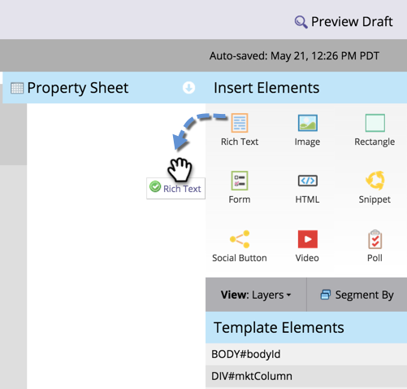

# 将文本和令牌添加到登陆页面 {#add-text-and-tokens-to-a-landing-page}

>[!NOTE]
>
>仅在Marketo登陆页面中支持令牌。

## 向登陆页面添加富文本 {#add-rich-text-to-your-landing-page}

1. 选择您的登陆页面，然后单击 **编辑草稿**.

   

   >[!NOTE]
   >
   >登陆页面设计器将在新窗口中打开。

1. 拖动到 **富文本** 元素。

   

1. 输入所需文本并单击 **保存**.

   

现在，您已了解如何向登陆页面添加文本，让我们着手添加令牌。

## 向登陆页面添加令牌 {#add-a-token-to-your-landing-page}

令牌是文本的动态部分，可个性化您的登陆页面。

>[!TIP]
>
>名字之类的东西来自个人记录。 其他令牌则来自程序中的“我的令牌”选项卡。

1. 选择您的登陆页面，然后单击 **编辑草稿**.

   

   >[!NOTE]
   >
   >登陆页面设计器将在新窗口中打开。

1. 双击要向其中添加令牌的富文本框。

   

1. 单击插入令牌图标。

   

1. 查找并选择您选择的令牌。

   

1. 输入 **默认值** 并单击 **插入**.

   

1. 单击 **保存**.

   

   任务已完成！ 您的登陆页面上现在有一个令牌。
