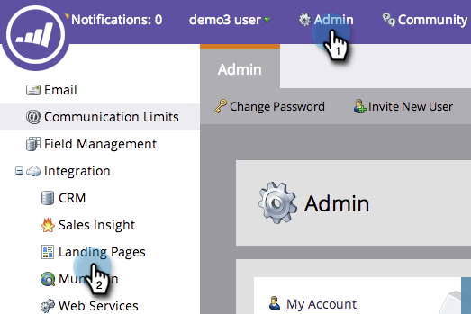

# 为您的帐户启用个性化 URL {#enable-personalized-urls-for-your-account}

个性化URL非常适合打印邮件营销活动。

>[!NOTE]
>
>**需要管理员权限**

1. 转到&#x200B;**[!UICONTROL Admin]**&#x200B;部分并单击&#x200B;**[!UICONTROL Landing Pages]**。

   

1. 单击 **[!UICONTROL Edit]**。

   

1. 选中&#x200B;**[!UICONTROL Enable Personalized URLs]**&#x200B;框并单击&#x200B;**[!UICONTROL Save]**。

   

您已为帐户启用PURL。 您现在可以为各个登陆页面启用它们。

>[!NOTE]
>
>如果两个人的名字和/或姓氏相同，系统会自动在其PURL名称的末尾附加一个数字。
>
>示例：
>
>1. 安娜琼斯
>1. 安娜琼斯2
>1. 安娜琼斯3
