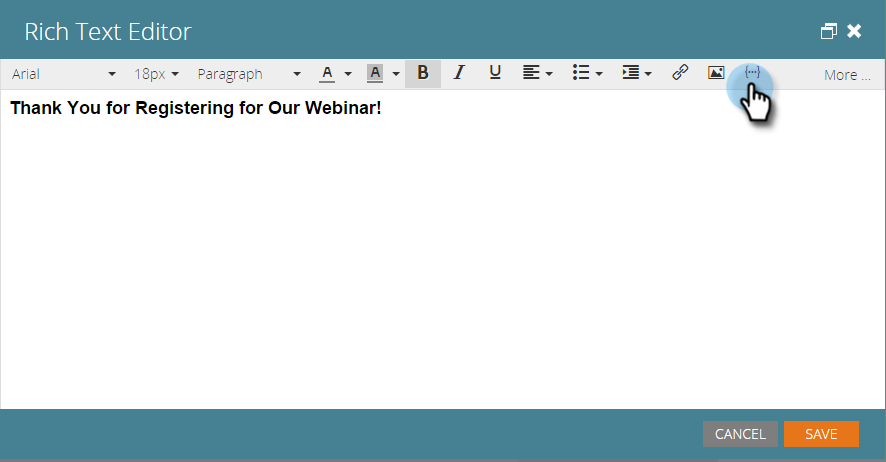

# 在登陆页面中包含日历事件ICS文件 {#include-a-calendar-event-ics-file-in-a-landing-page}

A **日历文件** 令牌允许您向Marketo登陆页面添加日历事件(.ics)链接。

>[!PREREQUISITES]
>
>* [创建日历事件(.ics)文件](/help/marketo/product-docs/email-marketing/general/functions-in-the-editor/create-a-calendar-event-ics-file.md)

1. 在登陆页面编辑器中，单击 **{...}** 以插入令牌。

   

1. 选择 **日历文件** 令牌并单击 **插入**.

   >[!CAUTION]
   >
   >登陆页面上不支持以下令牌：
   >
   >* member.webinar URL

   

1. 单击 **保存**.

   用户将看到如下所示的登陆页面：

   

真贴心！ 现在一切应该都很顺利。 确保进行测试。

>[!MORELIKETHIS]
>
>[在电子邮件中包含日历事件(.ics)](/help/marketo/product-docs/email-marketing/general/functions-in-the-editor/include-a-calendar-event-ics-in-an-email.md)
