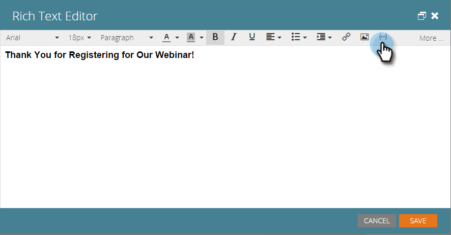

# 在登录页面中包含日程表事件 ICS 文件 {#include-a-calendar-event-ics-file-in-a-landing-page}

**[!UICONTROL Calendar File]**&#x200B;令牌允许您向Marketo登陆页面添加日历事件(.ics)链接。

>[!PREREQUISITES]
>
>* [创建日历事件(.ics)文件](/help/marketo/product-docs/email-marketing/general/functions-in-the-editor/create-a-calendar-event-ics-file.md)

1. 在登陆页编辑器中，单击&#x200B;**{...}**&#x200B;插入令牌。

   

1. 选择&#x200B;**[!UICONTROL Calendar File]**&#x200B;令牌并单击&#x200B;**[!UICONTROL Insert]**。

   >[!CAUTION]
   >
   >登陆页面上不支持以下令牌：
   >
   >* member.webinar URL

   

1. 单击 **[!UICONTROL Save]**。

   用户将看到如下所示的登陆页面：

   

确保在批准登陆页面之前测试日历链接。

>[!MORELIKETHIS]
>
>[在电子邮件中包含日历事件(.ics)](/help/marketo/product-docs/email-marketing/general/functions-in-the-editor/include-a-calendar-event-ics-in-an-email.md)
