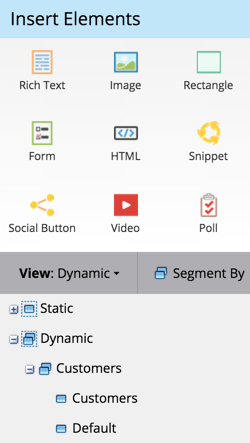

# 在登陆页中使用动态内容 {#use-dynamic-content-in-a-landing-page}

>[!PREREQUISITES]
>
>* [创建分段](../../../../product-docs/personalization/segmentation-and-snippets/segmentation/create-a-segmentation.md)
>* [创建自由格式登陆页](../../../../product-docs/demand-generation/landing-pages/free-form-landing-pages/create-a-free-form-landing-page.md)
>* [将新表单添加到自由表单登陆页](../../../../product-docs/demand-generation/landing-pages/free-form-landing-pages/add-a-new-form-to-a-free-form-landing-page.md)

>

在登陆页中使用动态内容可让用户获得有针对性的信息。

## 添加分段 {#add-segmentation}

1. 转到营 **销活动**。

   

   单击登陆页，然后单击“编辑草稿”。

   

   单击区段依据。

   

   输入分段名称，然后单击保存。

   

   您的细分及其细分显示在右侧的“动态”下。

   

   >[!NOTE]
   >
   >默认情况下，所有登陆页元素均为静态。

## 使元素动态 {#make-element-dynamic}

1. 将元素从“静态”拖放到“动 **态”**。

   

1. 您还可以从元素设置中将元素设置为“静态”或“动 **态”**。

   

## 应用动态内容 {#apply-dynamic-content}

1. 选择段下的元素，然后单击“编 **辑”**。 对每个区段重复上述步骤。

   

1. 绿色复选标记表示特定于区段的内容。 空白表示默认区段内容。

   

   >[!CAUTION]
   >
   >对默认区段内容块所做的更改会应用于所有区段。

   >[!TIP]
   >
   >在修改不同区段的内容之前，创建默认登陆页。

瞧！ 您现在可以发送目标内容。

>[!NOTE]
>
>**相关文章**
>
>* [预览具有动态内容的登陆页](../../../../product-docs/demand-generation/landing-pages/landing-page-actions/preview-a-landing-page-with-dynamic-content.md)
>* [在电子邮件中使用动态内容](../../../../product-docs/email-marketing/general/functions-in-the-editor/using-dynamic-content-in-an-email.md)

>

