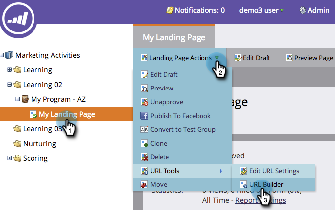

# 使用URL生成器 {#using-the-url-builder}

URL生成器可帮助您构建可填充Marketo隐藏表单字段的URL。

>[!PREREQUISITES]
>
>了解如何在表单中创建隐藏字段，并在 [将表单字段设置为隐藏](/help/marketo/product-docs/demand-generation/forms/form-fields/set-a-form-field-as-hidden.md).

1. 选择登陆页面，单击 **登陆页面操作**，悬停 **URL工具**，然后单击 **URL生成器**.

   

1. 选择要使用的字段，输入值，然后单击 **更新URL**.

   

   >[!NOTE]
   >
   >如果在生成器中未看到任何可用字段，请确保您的表单具有隐藏字段，并且这些字段为 [设置为接受URL参数](/help/marketo/product-docs/demand-generation/forms/form-fields/set-a-hidden-form-field-value.md#url-parameter).

干得好！ 您现在可以复制并粘贴该URL，并将其用在Web上。
