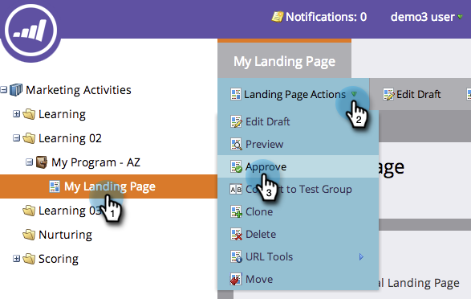

# 批准、取消批准或删除登陆页面 {#approve-unapprove-or-delete-a-landing-page}

在您批准登陆页面之前，登陆页面处于草稿模式。 批准后，系统其余部分中的页面均可用。 编辑已批准的登陆页面时，Marketo会保存草稿，但会继续使用已批准的版本，直到您批准草稿为止。

## 批准登陆页面 {#approve-a-landing-page}

1. 选择登陆页面，转到 **登陆页面操作** 单击 **批准**.

   >[!TIP]
   >
   >您可以 [同时批准多个页面](/help/marketo/product-docs/demand-generation/landing-pages/landing-page-actions/approve-multiple-landing-pages-at-once.md) 让你的生活更轻松。

   

1. 您还可以右键单击您的登陆页面，然后单击 **批准**.

   

   >[!NOTE]
   >
   >批准后，登陆页面图标上将显示一个绿色复选标记。

## 取消批准登陆页面 {#unapprove-a-landing-page}

1. 选择登陆页面，转到 **登陆页面操作** 单击 **取消批准**.

   

1. 您还可以右键单击登陆页面，然后单击 **取消批准**.

   

>[!NOTE]
>
>您的未批准的登陆页面将不再发布在Web上，并且不会生成任何其他活动。 未批准的登陆页面及其Facebook选项卡的访客将看到 [回退页面](/help/marketo/product-docs/administration/settings/set-a-fallback-page.md).

## 删除登陆页面 {#delete-a-landing-page}

1. 选择登陆页面，转到 **登陆页面操作** 单击 **删除**.

   

   >[!NOTE]
   >
   >您无法删除已批准的登陆页面。 先取消批准。

1. 您还可以右键单击您的登陆页面，然后单击 **删除**.

   

## 删除多个登陆页面 {#delete-multiple-landing-pages}

是否要一次删除多个登陆页面？ 这是方法。

1. 在Design Studio中，单击 **登陆页面**.

   

1. 单击要删除的第一个登陆页面，然后按住Shift并单击最后一个登陆页面。

   

   >[!TIP]
   >
   >您还可以通过按住ctrl并单击来删除多个不是按顺序的登陆页面。

1. 单击 **登陆页面操作** 下拉框并选择 **删除**.

   

1. 单击 **删除**.

   

太棒了！ 现在，您已了解如何批准、取消批准和删除登陆页面。
