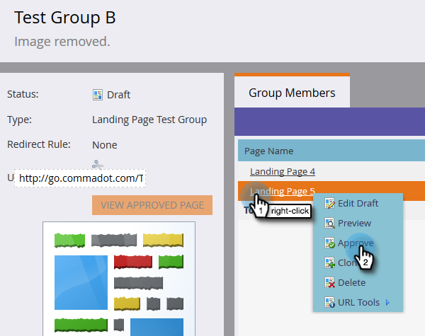

# 登陆页面测试组 {#landing-page-test-groups}

Marketo跟踪测试组中每个已测试页面的页面查看次数和表单完成次数。 您可以使用测试组结果来确定哪个登陆页面最引人注目。 下面是如何创建测试组的。

>[!PREREQUISITES]
>
>[构建两个或多个登陆页面](/help/marketo/getting-started/quick-wins/landing-page-with-a-form.md)，最好使用表单。

1. 在设计工作室中，单击&#x200B;**新建**。 在下拉列表中，选择&#x200B;**新建测试组**。

   

   >[!NOTE]
   >
   >创建测试组的其他方法有：
   >
   >* 右键单击树中的登录页面，然后选择&#x200B;**转换为测试组**
   >* 在&#x200B;**新建本地资产**&#x200B;菜单中选择&#x200B;**AB测试组**，在程序中创建登陆页面测试组

1. 输入名称和可选说明。 选择要测试的登陆页面，然后单击&#x200B;**创建**。

   

   >[!NOTE]
   >
   >只有未批准的登陆页面才可供选择。

1. 右键单击每个登陆页面，然后选择&#x200B;**批准**。

   

1. 单击&#x200B;**测试组选项**&#x200B;下拉列表，然后选择&#x200B;**批准测试组**。

   

   就是这样！ 现在，您将能够比较选定登陆页面的统计信息。

   

   >[!TIP]
   >
   >如果要删除测试组，只需单击&#x200B;**测试组操作**&#x200B;并选择&#x200B;**删除测试组**。
