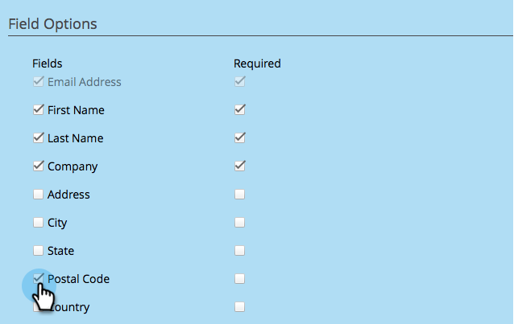

# 为社交应用程序配置人员捕获 {#configure-person-capture-for-a-social-app}

当您创建 [推荐优惠](/help/marketo/product-docs/demand-generation/social/referral-offers/create-a-referral-offer.md) 或 [抽奖](/help/marketo/product-docs/demand-generation/social/sweepstakes/create-sweepstakes.md)，您可以配置请求哪些信息以及向人员请求哪些信息以便参与。

>[!NOTE]
>
>只有以前未提供此信息时，才会提示用户输入此信息。

1. 转到 **营销活动**.

   

1. 选择应用程序，然后单击 **编辑草稿**.

   

1. 在社交应用程序编辑器中，转到 **注册流程** > **人员捕获**.

   

1. 选择您将请求的信息，并指明注册优惠所特别需要的字段。

   

   包括营销选项：

   * **选择禁用**：默认情况下订阅了人员。
   * **选择启用**：人员可以选择订阅。

   >[!NOTE]
   >
   >无论是哪种情况，参与者仍将获得 [_可操作_ 电子邮件](/help/marketo/product-docs/email-marketing/general/functions-in-the-editor/make-an-email-operational.md) 你的报价。

1. 在“查看和编辑”窗口中，单击 **显示编辑** 并在共享提示符下编辑消息。

   

>[!MORELIKETHIS]
>
>现在您可以 [配置社交注册流](/help/marketo/product-docs/demand-generation/social/configuring-social-actions/configure-social-sign-up-share-flow.md) 并编辑将发布到每个社交网络的共享消息。
