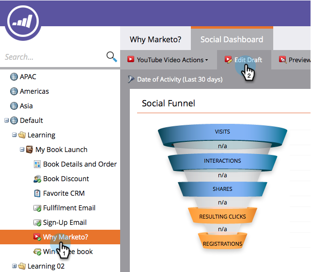
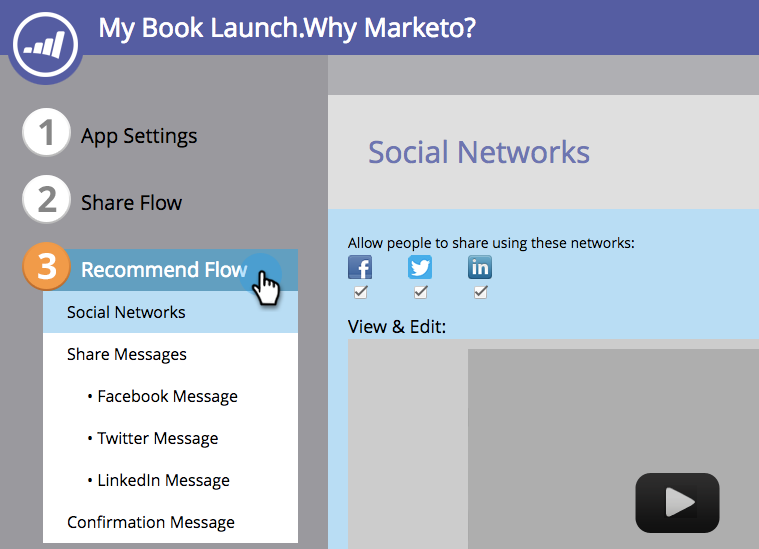
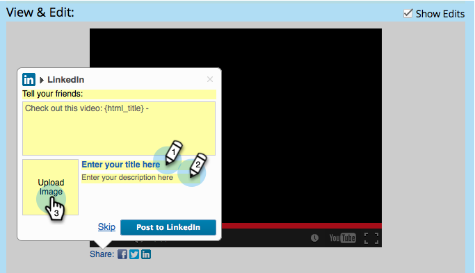

# 配置社交推荐流 {#configure-social-recommend-flow}

在创建社交应用程序时，您可以配置社交网络选项，并在用户注册时提示用户遇到这些选项。

## 选择要共享的网络 {#select-networks-for-sharing}

>[!NOTE]
>
>这与 [配置社交注册/共享流](/help/marketo/product-docs/demand-generation/social/configuring-social-actions/configure-social-sign-up-share-flow.md)，但这适用于共享链接 _下_ 社交应用程序。

1. 转到 **营销活动**.

   

1. 选择应用程序，然后单击 **编辑草稿**.

   

1. 在社交应用程序编辑器中，转到 **推荐流量** > **社交网络**.

   

1. 选择用户可以共享到的网络。

   

## 配置Facebook消息 {#configure-the-facebook-message}

1. 配置将显示在Facebook帖子中的消息。

   

   >[!NOTE]
   >
   >在视频共享中，将自动生成缩略图。

   如果您选择 **添加动态内容**，页面的OpenGraph标记（og：title、og：caption和og：description）和缩略图的值会自动添加到Facebook帖子中。 请参阅下一步。

   如果您选择 **添加静态内容**，输入标题、字幕和描述，然后上传图像。 请参阅接下来的两个步骤。

1. 在“查看和编辑”窗口中，单击 **显示编辑** 自定义将显示在Facebook帖子中的共享提示和消息。

   >[!TIP]
   >
   >有关更多信息，请参阅 [编辑Facebook富帖子设置](/help/marketo/product-docs/demand-generation/facebook/edit-facebook-rich-post-settings.md).

   

   >[!NOTE]
   >
   >此 [共享URL](/help/marketo/product-docs/demand-generation/social/social-functions/choose-the-share-url-for-a-social-app.md) 自动添加到所有共享消息。

1. 如果您选择 **添加静态内容** 在上方编辑标题、字幕和描述，并上传自定义图像(通过Marketo图像和文件)。

   

   参见 [将图像和文件添加到Marketo](/help/marketo/product-docs/demand-generation/images-and-files/add-images-and-files-to-marketo.md).

   >[!NOTE]
   >
   >如果上传图像，则在关闭并重新打开社交应用程序编辑器之前，您将不会在此处看到该图像。

1. 单击 **下一个**.

如果选择，则页面的OpenGraph标记（og：title、og：caption和og：description）和缩略图的值将自动添加到Facebook帖子中。 请参阅下一步。

## 配置Twitter消息 {#configure-the-twitter-message}

1. 单击以编辑共享提示和将显示在Twitter推文中的消息。

   

   >[!TIP]
   >
   >使用 {html_title} 在推文文本中自动显示页面标题。

1. 单击 **下一个**.

## 配置LinkedIn消息 {#configure-the-linkedin-message}

1. 配置将显示在LinkedIn帖子中的消息。

   

   如果您选择 **添加动态** “内容”、“页面标记”的值（标题和描述）以及缩略图会自动添加到LinkedIn帖子中。 请参阅下一步。

   如果您选择 **添加静态** 内容，输入标题、字幕和描述，然后上传图像。 请参阅接下来的两个步骤。

1. 在 **查看和编辑** 窗口，单击 **显示编辑** 和编辑将显示在LinkedIn帖子中的共享提示和消息。

   

   >[!TIP]
   >
   >使用 {html_title} 在帖子文本中自动显示页面标题。

1. 如果您选择 **添加静态** 内容，编辑标题和描述，并上传自定义图像(通过Marketo图像和文件)。

   

   参见 [将图像和文件添加到Marketo](/help/marketo/product-docs/demand-generation/images-and-files/add-images-and-files-to-marketo.md).

   >[!NOTE]
   >
   >如果上传图像，则在关闭并重新打开社交应用程序编辑器之前，您将不会在此处看到该图像。

1. 单击 **下一个**.

## 配置确认消息 {#configure-the-confirmation-message}

1. 编辑共享确认的文本。

   

1. 单击 **完成** > **批准** 和 **关闭**.

   

>[!MORELIKETHIS]
>
>下一步是 [添加您的视频共享](/help/marketo/product-docs/demand-generation/social/configuring-social-actions/customize-video-share-flow.md) 或 [轮询](/help/marketo/product-docs/demand-generation/social/creating-a-poll/create-a-poll.md) 登陆页面、Facebook或您自己的网站。
