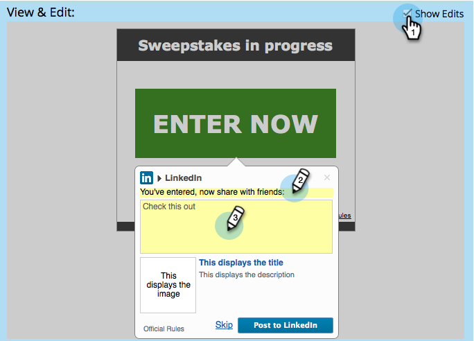

# 配置社交注册/共享流 {#configure-social-sign-up-share-flow}

在创建社交应用程序时，您可以配置社交网络选项，并在用户注册时提示用户遇到这些选项。

## 选择要共享的网络 {#select-networks-for-sharing}

1. 转到 **营销活动**.

   

1. 选择应用程序，然后单击 **编辑草稿**.

   

1. 在社交应用程序编辑器中，单击 **注册流程** > **社交网络**.

   

1. 选择（或取消选择）人员可以共享到的网络。

   

## 配置Facebook消息 {#configure-the-facebook-message}

1. 转到 **注册流程** > **共享消息**.

   

1. 配置将显示在Facebook帖子中的消息。

   

   >[!NOTE]
   >
   >在视频共享中，将自动生成缩略图。

   如果您选择 **添加动态内容**，页面的 **OpenGraph** 标签（og：title、og：caption和og：description）和缩略图会自动添加到Facebook帖子中。 请参阅下一步。

   如果您选择 **添加静态内容**，输入标题、字幕、描述并上传图像。 请参阅接下来的两个步骤。

1. 在“查看和编辑”窗口中，单击 **显示编辑** 和编辑将显示在Facebook帖子中的共享提示和消息。

   >[!TIP]
   >
   >有关更多信息，请参阅 [编辑Facebook富帖子设置](/help/marketo/product-docs/demand-generation/facebook/edit-facebook-rich-post-settings.md).

   

   >[!NOTE]
   >
   >此 [共享URL](/help/marketo/product-docs/demand-generation/social/social-functions/choose-the-share-url-for-a-social-app.md) 自动添加到所有共享消息。

1. 如果您选择 **添加静态内容** 在上面，编辑标题、字幕和描述，并上传自定义图像(从您的 [**Marketo图像和文件**](/help/marketo/product-docs/demand-generation/images-and-files/add-images-and-files-to-marketo.md))。

   

   参见 [将图像和文件添加到Marketo](/help/marketo/product-docs/demand-generation/images-and-files/add-images-and-files-to-marketo.md).

   >[!NOTE]
   >
   >如果上传图像，则在关闭并重新打开社交应用程序编辑器之前，您将不会在此处看到该图像。

1. 单击 **下一个**.

如果您选择页面标记的值（og：title、og：caption和og：description），则缩略图会自动添加到Facebook帖子中。 请参阅下一步。

## 配置Twitter消息 {#configure-the-twitter-message}

1. 编辑共享提示和将显示在Twitter推文中的消息。

   

   >[!TIP]
   >
   >使用 {html_title} 在推文文本中自动显示页面标题。

1. 单击 **下一个**.

## 配置LinkedIn消息 {#configure-the-linkedin-message}

1. 配置将显示在LinkedIn帖子中的消息。

   

   如果您选择 **添加动态内容**、页面标记的值（标题和描述）和缩略图会自动添加到LinkedIn帖子中。 请参阅下一步。

   如果您选择 **添加静态内容**，输入标题、字幕和描述，然后上传图像。 请参阅接下来的两个步骤。

1. 在 **查看和编辑** 窗口，单击 **显示编辑** 和编辑将显示在LinkedIn帖子中的共享提示和消息。

   

   >[!TIP]
   >
   >使用 {html_title} 在帖子文本中自动显示页面标题。

1. 如果您选择 **添加静态内容** 在上面，编辑标题和描述，并上传自定义图像(从 [**Marketo图像和文件**](/help/marketo/product-docs/demand-generation/images-and-files/add-images-and-files-to-marketo.md))。

   

>[!NOTE]
>
>如果上传图像，则在关闭并重新打开社交应用程序编辑器之前，您将不会在此处看到该图像。

>[!MORELIKETHIS]
>
>接下来，您可以单击 **完成** > **批准并关闭** 将您的社交应用程序放在登陆页面上。 您还可以配置 [人员捕获](/help/marketo/product-docs/demand-generation/social/configuring-social-actions/configure-person-capture-for-a-social-app.md) 或 [重新共享提示](/help/marketo/product-docs/demand-generation/social/configuring-social-actions/configure-re-share-email-and-prompt-for-a-social-app.md).
