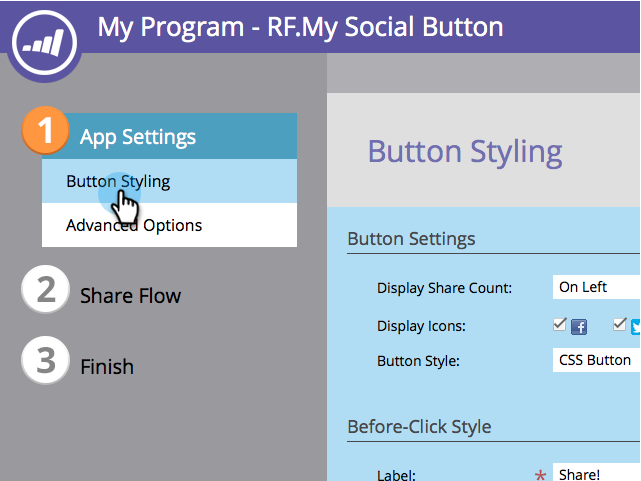

# “自定义社交应用程序”按钮 {#customize-social-app-button}

当您创建 [社交按钮](/help/marketo/product-docs/demand-generation/landing-pages/free-form-landing-pages/add-a-social-button-to-a-free-form-landing-page.md) 或 [反向链接优惠](/help/marketo/product-docs/demand-generation/social/referral-offers/create-a-referral-offer.md)中，您可以自定义按钮的外观。

1. 转到 **营销活动**.

   

1. 选择应用程序，然后单击 **编辑草稿**.

   

1. 在社交应用程序编辑器中，转到 **应用程序设置** > **按钮样式** (或 **注册方式，** （适用于反向链接选件）。

   

1. 选择显示共享计数的位置或不显示共享计数。

   

1. 选择要显示哪些社交网络图标及其相应按钮。

   

   >[!NOTE]
   >
   >对于反向链接选件，请在下面选择您的网络 **2. 注册流>社交网络**.

1. 选择按钮类型。

   

   >[!TIP]
   >
   >如果您选择 **在按钮样式下上传图像** 在上图中，以下部分允许您上传按钮图像而不是编辑文本。

1. 编辑按钮的标签，在单击之前和之后。

   

1. 作出每个选择时，请查看以下文件中的结果： **查看和编辑** 窗口。

   

>[!NOTE]
>
>在推荐选件中，您还可以自定义 **跟踪进度** 按钮。 转到 **应用程序设置** > **跟踪进度样式** 并按照上述步骤执行操作。

>[!MORELIKETHIS]
>
>对于社交按钮， [在打开时配置](/help/marketo/product-docs/demand-generation/social/configuring-social-actions/configure-when-social-button-opens.md). 对于推荐报价， [指定优惠目标](/help/marketo/product-docs/demand-generation/social/referral-offers/specify-goal-for-referral-offer.md).
