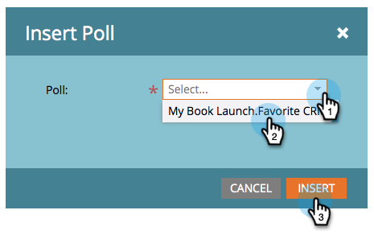

# 发布投票 {#publish-a-poll}

在您之后 [创建投票](/help/marketo/product-docs/demand-generation/social/creating-a-poll/create-a-poll.md)，您可以将其发布在Marketo登陆页面、Facebook和网站上。

1. 导航到您的登陆页面，然后打开它进行编辑。

   

1. 拖动到 **轮询** 从右侧的面板中。

   

1. 选择您的投票并单击 **插入**.

   

>[!NOTE]
>
>您需要批准投票，才能在此处使用投票。

恭喜！批准登陆页面，并且您的投票处于实时状态。 您还可以 [将登陆页面发布到Facebook](/help/marketo/product-docs/demand-generation/facebook/publish-landing-pages-to-facebook.md) 或 [将投票放置到您的网站上](/help/marketo/product-docs/demand-generation/social/social-functions/deploy-social-on-your-website.md).

>[!TIP]
>
>测试并优化您的投票。 转到网页上的投票并使用测试信息注册。 记下您要更改的有关用户体验的所有内容。
