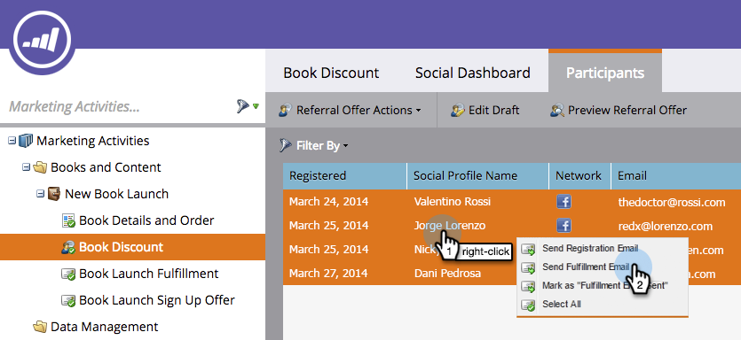

# 发送推荐选件履行电子邮件 {#send-referral-offer-fulfillment-email}

使用优惠单履行电子邮件向客户提供优惠券和折扣代码。

>[!PREREQUISITES]
>
>* [在社交促销活动中使用电子邮件](/help/marketo/product-docs/demand-generation/social/social-functions/use-emails-in-social-promotions.md)
>* [创建反向链接选件](/help/marketo/product-docs/demand-generation/social/referral-offers/create-a-referral-offer.md)

## 设置履行投放 {#set-up-fulfillment-delivery}

1. 选择引荐选件。 单击 **编辑草稿**.

   

1. 在 **应用程序设置**，选择 **选件详细信息**.

   

1. 选择 **注册电子邮件**.

   

1. 选择 **履行电子邮件**.

   

   >[!NOTE]
   >
   >详细了解 [在社交促销活动中使用电子邮件](/help/marketo/product-docs/demand-generation/social/social-functions/use-emails-in-social-promotions.md).

1. 单击 **履行交付** 下拉框并选择 **自动实现目标**.

   

   在中选择的消息 **履行电子邮件** 将自动发送给达到目标的人员。

## 手动发送 {#manual-send}

您可以在人员达到目标后，手动向其发送履行电子邮件。

1. 选择引荐选件并单击 **参与者** 选项卡。

   

1. 单击 **过滤依据** 选项和选择 **目标**.

   >[!NOTE]
   >
   >这会选择符合推荐选件目标的人员。

   

1. 在过滤的视图中选择人员。

   

1. 右键单击并选择 **发送履行电子邮件**.

   

太棒了！ 这些人现在将收到履约电子邮件，并对他们的奖励感到兴奋。
