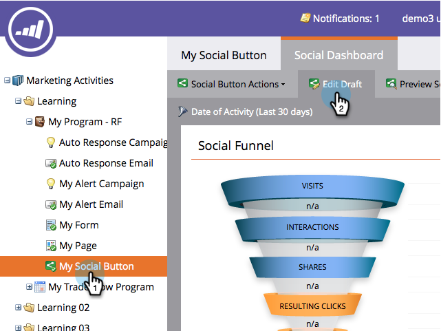
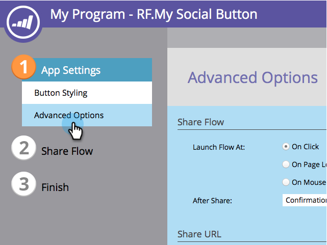

# 将您的隐私策略添加到社交应用程序 {#add-your-privacy-policy-to-a-social-app}

在创建社交应用程序时，您可以添加指向贵公司隐私策略的链接。

1. 转到 **营销活动**.

   

1. 选择应用程序，然后单击 **编辑草稿**.

   

1. 在社交应用程序编辑器中，转到 **应用程序设置** > **高级选项**.

   

1. 要添加指向您的隐私策略的链接，请选中复选框，编辑标题，然后输入URL。

   

   >[!NOTE]
   >
   >在此屏幕上，您还可以添加指向优惠规则（条款和条件）的链接。 请参阅 [创建反向链接选件](/help/marketo/product-docs/demand-generation/social/referral-offers/create-a-referral-offer.md).

1. 隐私策略链接（和规则链接）将显示在共享消息屏幕的底部。 例如：

   

接下来，您可以 [配置社交注册和共享流](/help/marketo/product-docs/demand-generation/social/configuring-social-actions/configure-social-recommend-flow.md) 应用程序的ID。
