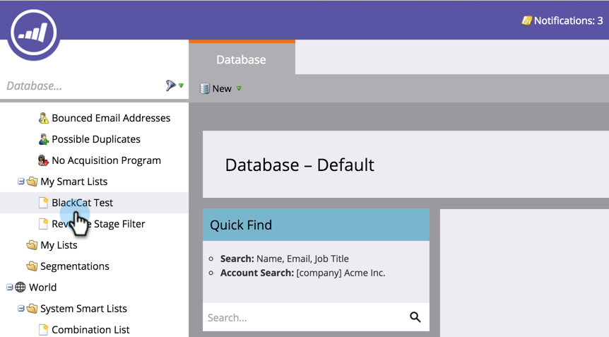

# 使用Marketo列表或智能列表作为LinkedIn受众区段 {#use-a-marketo-list-or-smart-list-as-a-linkedin-audience-segment}

将Marketo人员与LinkedIn受众集成。

>[!PREREQUISITES]
>
>[将LinkedIn匹配的受众添加为LaunchPoint服务](/help/marketo/product-docs/demand-generation/ad-network-integrations/add-linkedin-matched-audiences-as-a-launchpoint-service.md)

1. 转到 **数据库**.

   

1. 选择一个智能列表。

   

1. 单击 **人员** 选项卡。

   

1. 单击 **通过Ad Bridge发送** 图标  ，位于列表底部。

   

   >[!NOTE]
   >
   >使用广告网络集成将受众发送到LinkedIn时，Marketo只发送电子邮件地址。

1. 选择 **linkedIn** 并单击 **下一个**.

   

1. 选择 **linkedIn受众**.

   >[!NOTE]
   >
   >点击 **+新建受众** 将在LinkedIn Campaign Manager中创建受众。

   

   >[!NOTE]
   >
   >linkedIn已于2018年3月弃用用于“清除受众并添加潜在客户”推送类型的API。 自Marketo 2018年第1季度发布起，此选项不再可用。

1. 选择 **推送类型**. 单击 **更新**.

   

   >[!NOTE]
   >
   >请等待15分钟进行同步。

击掌！ 您的数据现在将与LinkedIn的受众共享。 有关将列表上传到LinkedIn以进行客户和联系人定位的信息，请访问 [linkedIn的营销解决方案帮助中心](https://www.linkedin.com/help/lms/answer/73938?query=ad%20segment).
