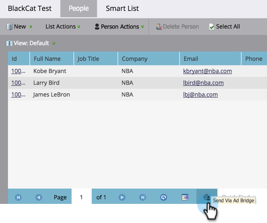

# 将 Marketo 列表或智能列表用作 LinkedIn 受众区段 {#use-a-marketo-list-or-smart-list-as-a-linkedin-audience-segment}

将Marketo Engage人员与LinkedIn受众集成。

>[!PREREQUISITES]
>
>[将LinkedIn匹配的受众添加为LaunchPoint服务](/help/marketo/product-docs/demand-generation/ad-network-integrations/add-linkedin-matched-audiences-as-a-launchpoint-service.md){target="_blank"}

1. 转到&#x200B;**[!UICONTROL Database]**。

   

1. 选择一个智能列表。

   

1. 单击 **[!UICONTROL People]** 选项卡。

   

1. 单击列表底部的&#x200B;**[!UICONTROL Send Via Ad Bridge]**&#x200B;图标。

   

   >[!NOTE]
   >
   >使用广告网络集成将受众发送到LinkedIn时，Marketo仅发送电子邮件地址通过。

1. 选择 **[!UICONTROL LinkedIn]** 并点击 **[!UICONTROL Next]**。

   

1. 选择&#x200B;**[!UICONTROL LinkedIn Audience]**。

   >[!NOTE]
   >
   >单击&#x200B;**[!UICONTROL +New Audience]**&#x200B;将在LinkedIn营销活动管理器中创建受众。

   

   >[!NOTE]
   >
   >LinkedIn已在2018年3月弃用用于“清除受众并添加潜在客户”推送类型的API。 自Marketo 2018年第1季度版本发布起，此选项不再可用。

1. 选择&#x200B;**[!UICONTROL Push Type]**。 单击 **[!UICONTROL Update]**。

   

   >[!NOTE]
   >
   >等待同步完成15分钟。

您的数据现在将与LinkedIn的受众同步。 有关将列表上载到LinkedIn以进行帐户和联系人定位的信息，请访问[LinkedIn的营销解决方案帮助中心](https://www.linkedin.com/help/lms/answer/73938?query=ad%20segment){target="_blank"}。
