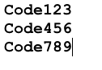

# 使用促销代码完成优惠 {#use-promo-codes-for-offer-fulfillment}

在创建推荐选件或抽奖活动时，您可以向每位入选者发送促销（优惠券）代码。 为了兑现奖励，他们会使用代码，例如，在您的网站上购买的结账页面上。

## 上传促销代码 {#upload-promo-codes}

1. 转到 **营销活动**.

   

1. 选择反向链接选件，然后单击 **编辑草稿**.

   

1. 在反向链接选件编辑器中，转到 **应用程序设置** 然后 **优惠详细信息**.

   

1. 在电子邮件下，选择 **使用促销代码**，并在上传代码下，单击 **浏览** 以从系统中选择促销代码文件。

   

1. 促销代码文件必须是纯ASCII文本文件，每行有一个代码，文件扩展名为.txt。 例如：

   

   >[!CAUTION]
   >
   >促销代码文件中的任何空格都将被视为该行代码的一部分。 尤其要注意避免在每行末尾出现尾随空格。

1. 上传完成后，将显示已上传代码的总数。

   

## 查看已发送的促销代码 {#review-sent-promo-codes}

一旦参与者开始获得您的优惠奖励，您就可以查看哪些促销代码被发送给谁以及何时发送。

>[!NOTE]
>
>仅Marketo用户具有 _访问奖_ 权限访问此信息。 请参阅  [管理用户角色和权限](/help/marketo/product-docs/administration/users-and-roles/managing-user-roles-and-permissions.md).

1. 转到 **营销活动**.

   

1. 选择您的推荐选件或抽奖，然后单击 **参与者** 选项卡。

   

1. 您应该在此处看到一些条目。 单击 **促销代码** 列以查看发送给该参与者的促销代码以及时间。

   
