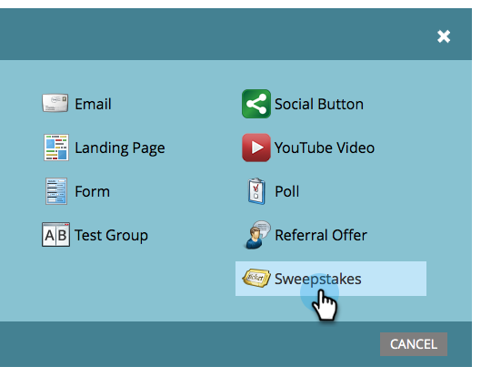

# 创建抽奖 {#create-sweepstakes}

抽奖让人们有机会赢得奖品，作为回报，他们向朋友讲述了你。 您可以将其放置到登陆页面、您的网站，甚至Facebook。

>[!AVAILABILITY]
>
>并非所有客户都购买了此功能。 有关详细信息，请联系您的销售代表。

1. 在您的项目中，选择 **新建** > **新建本地资产**.

   

1. 在本地资产库中，单击 **抽奖**.

   

1. 举出您的抽奖活动。

   

   >[!TIP]
   >
   >为了节省时间，您可以使用 **克隆自** 选项，以复制现有抽奖中的所有设置。

   抽奖编辑器在新窗口中打开。 默认设置都不错，但您仍需要配置一些详细信息。 我们将在后续步骤中向您展示如何操作。

1. 单击 **抽奖详细信息**.

   

1. 选择频率、开始和结束日期以及您所在的时区。

   

   >[!NOTE]
   >
   >对于每日和每周绘图，开始时间和结束时间分别固定在上午12点和晚上11:59。 对于一次性绘图，您可以选择自己的开始和结束时间。

1. 单击 **高级选项**.

   

1. 添加指向抽奖规则的链接。 输入URL。 此链接是必需的。

   

   链接将显示在共享消息屏幕的底部。

   >[!NOTE]
   >
   >在此屏幕上，您还可以添加隐私政策链接。 请参阅 [将隐私政策添加到社交应用程序](/help/marketo/product-docs/demand-generation/social/social-functions/add-your-privacy-policy-to-a-social-app.md).

1. 单击 **完成**.

   

1. 单击 **批准并关闭**.

   

   >[!TIP]
   >
   >要更改抽奖中的任何默认值，请单击 **返回**. 若要保存您的工作以供以后不批准，请单击 **关闭**.

如果抽奖中存在任何问题，系统会提示您在抽奖获得批准前解决这些问题。

祝贺您！您已创建抽奖活动。

>[!MORELIKETHIS]
>
>下一步是 [发布抽奖活动](/help/marketo/product-docs/demand-generation/social/sweepstakes/publish-a-sweepstakes.md)，但您可以更改抽奖的外观和设置。 开始于 [自定义抽奖样式](/help/marketo/product-docs/demand-generation/social/sweepstakes/customize-sweepstakes-styles.md).
