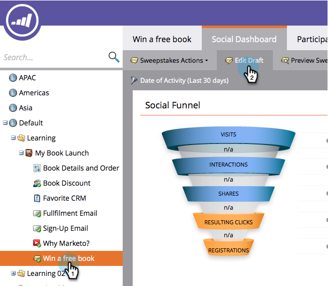

# 自定义抽奖样式{#customize-sweepstakes-styles}

当您[创建抽奖](/help/marketo/product-docs/demand-generation/social/sweepstakes/create-sweepstakes.md)时，您可以自定义它在您的登陆页上的显示方式。

>[!AVAILABILITY]
>
>并非所有客户都购买了此功能。 有关详细信息，请与您的销售代表联系。

1. 转至&#x200B;**营销活动**。

1. 选择抽奖，然后单击&#x200B;**编辑草稿**。

   

1. 在“抽奖”编辑器中，转至&#x200B;**“应用程序设置”**>>**“外观”**。

   

1. 编辑注册按钮和进度链接的文本。

   

1. 对于要自定义的每个元素，输入您的自定义CSS属性。

   

   **输入按钮**的CSS示例：
   `<pre>border: 5px solid #7B68EE; background-color: purple; padding: 10px; font: 16px; color: #FFFFFF; text-align: center;</pre>`

   **输入按钮**的图像示例：
   `<pre>background:url(https://app.marketo.com/images/public-site/button_sign-up-now.png) no-repeat center center; width:275px; height:95px; margin:auto; display:block;</pre>` `<pre>`

   >[!NOTE]
   >
   >如果您使用的图像上带有文本，请记住从上方“文本”下的&#x200B;**“输入按钮**”字段中删除文本。

1. 每次更改时，结果会显示在“视图和编辑”预览中。

   

   >[!NOTE]
   >
   >在包括旧版本在内的不同浏览器中测试按钮。

   >[!MORELIKETHIS]
   >
   >下一步是向抽奖活动](/help/marketo/product-docs/demand-generation/social/social-functions/use-emails-in-social-promotions.md)添加[注册和实施电子邮件。
