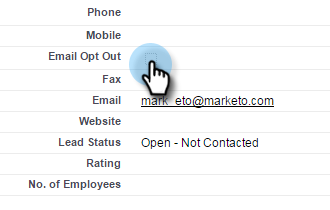

# 持久取消订阅 {#durable-unsubscribe}

Marketo改进了取消订阅功能的行为，使其具有“持久性”。 我们添加了主电子邮件状态，该状态与人员详细信息记录中显示的取消订阅标记不同。

如果取消订阅标志从false设置为true，则会更新主电子邮件状态，并且更改会传播给具有相同电子邮件地址的其他人。 如果删除人员后重新创建，或者使用相同的电子邮件地址创建了新记录，则取消订阅标志将&#x200B;**不会**&#x200B;被覆盖。

>[!NOTE]
>
>持久Unsubscribe可在整个Marketo数据库中的所有分区中使用。

## 将取消订阅标志从True更新为False（例如，重新订阅人员） {#update-the-unsubscribe-flag-from-true-to-false-e-g-re-subscribe-a-person}

可通过多种方式重新订阅用户。

在Salesforce中，清除潜在客户/联系人记录上的Email Opt Out字段。 这将同步到Marketo。

在Marketo中，清除人员记录的“信息”选项卡中的取消订阅框。

对一个或多个用户运行&#x200B;_更改数据值_&#x200B;流程步骤，如下所示。

## 创建新人员 {#creating-a-new-person}

创建新人员后，Marketo会根据主电子邮件状态表检查该人员。 如果人员之前已取消订阅，我们将更新要取消订阅的记录。

## 更改电子邮件地址 {#changing-an-email-address}

如果将人员的电子邮件地址更改为未订阅的电子邮件地址，则将取消订阅该人员。 可以在Marketo或Salesforce中进行此更改。

## 重新订阅 {#re-subscribing}

正如取消订阅将导致所有拥有相同电子邮件地址的人被取消订阅一样，重新订阅实际上将重新订阅拥有相同电子邮件地址的每个人。

>[!MORELIKETHIS]
>
>[了解取消订阅](/help/marketo/product-docs/email-marketing/deliverability/understanding-unsubscribe.md)
