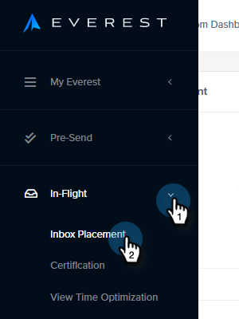

# 电子邮件可投放性功能包：如何导入种子列表 {#email-deliverability-power-pack-how-to-import-a-seed-list}

种子列表是多个邮箱提供商(包括Google应用程序、Hotmail、Yahoo！等)的电子邮件帐户列表，用于估计收件箱投放率与垃圾邮件文件夹投放率。 下面是如何将该列表放入您的Marketo实例。

>[!AVAILABILITY]
>
>并非所有客户都已购买此功能。 有关详细信息，请与您的销售代表联系。

## 导入种子列表 {#import-a-seed-list}

1. 在“我的Marketo”中，选择 **可投放性工具**.

   

1. Everest应用程序将会打开。 在左侧导航中，单击 **In-Flight** 并选择 **收件箱位置**.

   

1. 单击 **管理种子列表** 选项卡。

   

1. 单击操作下拉列表并选择 **每行下载一个**.

   

   >[!NOTE]
   >
   >如果您希望Everest为您优化列表，请使用种子列表优化器（位于页面顶部）。

1. 导出后，该列表将在浏览器的下载文件夹中显示为.txt文件。 检索它，并且 [导入](/help/marketo/getting-started/quick-wins/import-a-list-of-people.md) 将其作为静态列表输入到Marketo实例中。

   

   >[!TIP]
   >
   >请确保以易于查找的方式命名您的列表。

   >[!CAUTION]
   >
   >您每月获得的这些收件箱投放活动数量有限。 要查看你获得的数量，请查看Everest中帐户设置>订阅下的订阅部分。 要获取更多信息，请联系您的Marketo销售代表。

## 获取新种子列表 {#acquiring-new-seedlists}

您的种子列表每月可能会发生更改。 请务必定期登录Email Deliverability Power Pack并检查您的种子列表的状态。 添加新地址或需要您这端的更新时，将通过应用程序左下角的通知图标向您发出警报。

在Marketo中创建静态列表后，您可以开始向其发送以测试电子邮件的收件箱位置。
