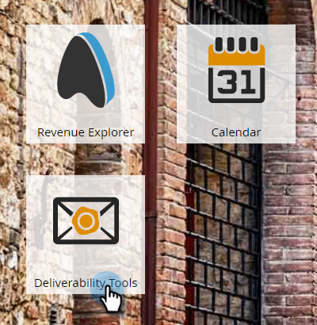

# 电子邮件可投放性Power Pack:如何导入种子列表 {#email-deliverability-power-pack-how-to-import-a-seedlist}

种子列表是多个邮箱提供商(包括Google应用程序、Hotmail、Yahoo！等)的电子邮件帐户列表，用于估算收件箱率与垃圾邮件文件夹可交付性。 以下是如何将该列表导入Marketo实例。

>[!AVAILABILITY]
>
>并非所有客户都购买了此功能。 有关详细信息，请联系您的销售代表。

## 导入种子列表 {#import-a-seedlist}

1. 转到 **投放能力工具**.

   

1. 单击 **收件箱线人**.

   

1. 单击 **获取种子列表**.

   

1. 单击 **导出列表**.

   

   >[!NOTE]
   >
   >选择 **优化列表** 如果你想要250ok [优化列表](https://help.returnpath.com/hc/en-us/articles/360046746451-What-is-250ok-s-seedlist-optimizer-and-why-should-I-use-it-) 为你。 选择 **自定义列表** 如果要选择要包含的种子列表区域。

1. 导出后，该列表将在浏览器的下载文件夹中显示为.txt文件。 检索它，然后 [导入](/help/marketo/getting-started/quick-wins/import-a-list-of-people.md) 作为静态列表放入Marketo实例中。

   

   >[!TIP]
   >
   >请务必以易于查找的方式命名列表。

   >[!CAUTION]
   >
   >您每月可获得有限数量的这些收件箱线人活动。 要查看您获得的数量，请查看您的250ok **帐户设置**. 要获取更多信息，请联系您的Marketo销售代表。

## 获取新种子列表 {#acquiring-new-seedlists}

您的种子列表每月可更改一次。 定期登录Email Deliverability Power Pack并检查种子列表的状态，这一点很重要。 当您的终端添加了新地址或需要更新时，您将通过“获取种子列表”页面上的界面收到警报。

在Marketo中创建静态列表后，您可以开始向其发送以测试电子邮件的收件箱位置。
