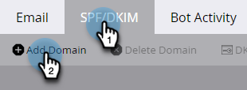

# 设置自定义DKIM签名 {#set-up-a-custom-dkim-signature}

为确保顶级可投放性，我们使用共享的Marketo DKIM签名自动对所有出站邮件进行签名。

>[!NOTE]
>
>您可能需要您的IT团队的帮助来完成本文中的某些步骤。

您可以个性化DKIM签名以反映您选择的域。 具体方法如下。

1. 转到 **管理员** 部分。

   

   >[!NOTE]
   >
   >如果您以传统方式设置自定义DKIM签名，它将继续工作，并且应该在此处显示。

1. 单击 **电子邮件**.

   

1. 单击 **SPF/DKIM** 选项卡，然后 **添加域**.

   

1. 输入将在Marketo电子邮件中使用的域作为发件人地址。 选择一个选择器和一个密钥大小。 单击 **添加** 完成时。

   

   >[!TIP]
   >
   >* 我们建议的关键规模为2048年。
   >* 如果您在发件人地址中使用其他域，我们将使用Marketo共享DKIM签名。

   <table> 
   <tr>
   <td width="20%"><b>选择器</b></td>
   <td>用于定位DKIM记录的公钥部分的唯一字符串/标识符。 它可以是一个任意字符串，也可以是一个唯一标识符，用于分隔和标识该DKIM密钥/记录的用途。</td>
   </tr>
   <tr> 
   <td width="20%"><b>密钥大小</b></td>
   <td>您希望对DKIM签名进行加密的安全级别。</td>
   </tr>
   </tbody>
   </table>

   

1. 发送 **主机记录** 和 **TXT值** 到你的IT。 要求他们为您创建记录，并确保该记录传播到与来自域关联的所有名称服务器。 Marketo的DKIM验证要求将DKIM密钥传播到与DKIM签名的域关联的所有名称服务器。

   

1. 确认创建了记录后，请返回Marketo并选择您的域，然后单击 **检查DNS**.

   

   >[!NOTE]
   >
   >如果确认失败，并且您的IT部门正确创建了记录，则可能与DNS传播有关。 请稍后重试。

   >[!CAUTION]
   >
   >修改/删除相应的DNS记录将导致有害的可投放性。 确保在进行DNS更改之前删除Marketo中的条目。

   这绝对有助于您的电子邮件可投放性。 您应该获得确认，记录存在并且正确。
