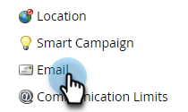

# 设置自定义 DKIM 签名 {#set-up-a-custom-dkim-signature}

为确保获得最佳可投放性，Marketo会自动使用共享的DKIM签名对所有出站邮件进行签名。

>[!NOTE]
>
>您可能需要您的IT团队的帮助来完成本文中的某些步骤。

您可以个性化DKIM签名以反映所选的域。

1. 转到&#x200B;**[!UICONTROL Admin]**&#x200B;部分。

   

   >[!NOTE]
   >
   >如果您使用旧版方法设置自定义DKIM签名，它将继续工作，并且应该显示在此处。

1. 单击&#x200B;**电子邮件**。

   

1. 单击&#x200B;**SPF/DKIM**&#x200B;选项卡，然后单击&#x200B;**添加域**。

   

1. 输入将在Marketo电子邮件中使用的域作为发件人地址。 选择一个选择器和一个密钥大小。 完成后单击&#x200B;**添加**。

   

   <table>
   <tr>
   <td width="20%"><b>选择器</b></td>
   <td>用于定位DKIM记录的公钥部分的唯一字符串/标识符。 它可以是任意字符串，也可以是用于区分开和标识该DKIM密钥/记录的用途的唯一标识符。</td>
   </tr>
   <tr>
   <td width="20%"><b>密钥大小</b></td>
   <td>您希望对DKIM签名进行加密的安全级别。</td>
   </tr>
   </tbody>
   </table>

   

   >[!TIP]
   >
   >* 建议密钥大小为2048。
   >* 如果您在发件人地址中使用其他域，Marketo将使用共享的DKIM签名。

   >[!IMPORTANT]
   >
   >如果您需要更新域的DKIM选择器或DKIM加密大小，则必须删除现有记录并使用新值重新发布新生成的记录。
   >
   >在执行此操作时，除非发布您的新记录并由我们的系统验证，否则将不会为您的域签署DKIM。 相应地规划您的更改，因为可能需要24到48小时，新的DKIM记录才能在互联网上完全传播。

1. 将&#x200B;**[!UICONTROL Host Record]**&#x200B;和&#x200B;**[!UICONTROL TXT Value]**&#x200B;发送到您的IT。 要求他们为您创建记录，并确保该记录传播到与来自域关联的所有名称服务器。 Marketo的DKIM验证要求将DKIM密钥传播到与DKIM签名的域关联的所有名称服务器。

   

1. 确认已创建记录后，返回Marketo，选择您的域，然后单击&#x200B;**[!UICONTROL Check DNS]**。

   

   >[!NOTE]
   >
   >如果确认失败，并且您的IT部门正确创建了记录，则可能与DNS传播有关。 请稍后重试。

   >[!CAUTION]
   >
   >修改/删除相应的DNS记录将导致有害的可投放性。 在进行DNS更改之前，删除Marketo中的条目。

   这将提高您的电子邮件可投放性。 您应该获得确认，记录存在并且正确。
