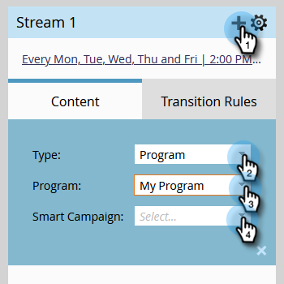

# 将内容添加到流 {#add-content-to-a-stream}

创建参与计划后，您需要将内容添加到流。 您可以将电子邮件或程序添加到流。

1. 转到 **营销活动**.

   

1. 选择您的参与计划，然后转到 **流** 选项卡。

   

   您可以通过两种不同的方式添加内容：

**“添加内容”按钮**

1. 单击 **添加内容** 按钮。

   

1. 选择 **电子邮件** _或_ **项目**，然后选择要添加的电子邮件或项目/智能营销策划。

   

   >[!TIP]
   >
   >此参与计划的本地电子邮件将按顶部排序。

**+图标**

1. 单击 **+** 图标，选择 **电子邮件** _或_ **项目**，然后选择要添加的电子邮件或项目/智能营销策划。

   

   >[!NOTE]
   >
   >智能营销活动必须包含 **参与计划成员** 进行筛选以使它正常工作。

做得好！ 您现在知道如何向项目流添加内容。 尽量多加点儿育儿用的。 有关更多详细信息，请参阅下面的相关文章。

>[!MORELIKETHIS]
>
>[将计划添加到参与计划流](/help/marketo/product-docs/email-marketing/drip-nurturing/creating-an-engagement-program/adding-a-program-to-an-engagement-program-stream.md)
