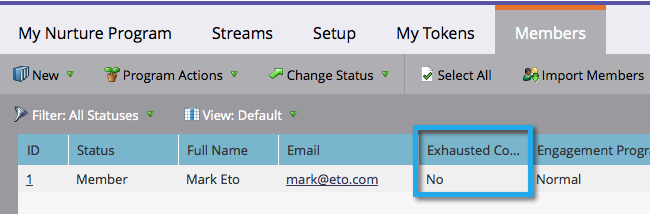

# 了解参与计划 {#understanding-engagement-programs}

参与方案旨在以系统的方式向新人介绍内容，以此向新人推销。

>[!NOTE]
>
>限制为100 **活动** 每个订阅的参与计划。

## 参与计划 {#engagement-program}

An **参与计划** 是一种能够轻松完成复杂培养的程序。

>[!MORELIKETHIS]
>
>[创建参与计划](/help/marketo/product-docs/email-marketing/drip-nurturing/creating-an-engagement-program/create-an-engagement-program.md)

## 串流 {#stream}

A **流** 是一个优先内容池，参与计划将利用它培养人才。

>[!MORELIKETHIS]
>
>* [添加流](/help/marketo/product-docs/email-marketing/drip-nurturing/creating-an-engagement-program/add-a-stream.md)
>* [克隆流](/help/marketo/product-docs/email-marketing/drip-nurturing/engagement-program-streams/clone-a-stream.md)

## 内容 {#content}

有两种类型 **内容** 您可以将添加到参与计划流 — 电子邮件和计划。 电子邮件将在转换时间发送给用户。

>[!MORELIKETHIS]
>
>* [将内容添加到流](/help/marketo/product-docs/email-marketing/drip-nurturing/creating-an-engagement-program/add-content-to-a-stream.md)
>* [排定流内容的优先级](/help/marketo/product-docs/email-marketing/drip-nurturing/using-stream-content/prioritize-stream-content.md)
>* [编辑流内容的可用性](/help/marketo/product-docs/email-marketing/drip-nurturing/using-stream-content/edit-availability-of-stream-content.md)
>* [删除流内容](/help/marketo/product-docs/email-marketing/drip-nurturing/using-stream-content/remove-stream-content.md)
>* [存档和取消存档流内容](/help/marketo/product-docs/email-marketing/drip-nurturing/using-stream-content/archive-and-unarchive-stream-content.md)

## 演员阵容 {#cast}

A **cast** 是从参与计划发送电子邮件的事件。

>[!NOTE]
>
>参与计划并非设计用于操作电子邮件。

## 流节奏 {#stream-cadence}

通过设置来确定何时进行强制转换 **流节奏**. 这就是安排定期发布内容的方式。

>[!MORELIKETHIS]
>
>[设置流节奏](/help/marketo/product-docs/email-marketing/drip-nurturing/engagement-program-streams/set-stream-cadence.md)

## 人员节奏 {#person-cadence}

A **人员节奏** 是一个状态，用于定义其从参与计划接收内容的能力。 您可以使用 **更改参与计划节奏** 流步骤，可将其更改为“已暂停”或“正常”。

## 已耗尽 {#exhausted}

当一个人收到一个流中的每一条内容时，我们就会称这个人 **已耗尽**.

>[!MORELIKETHIS]
>
>[已耗尽内容的人](/help/marketo/product-docs/email-marketing/drip-nurturing/using-engagement-programs/people-who-have-exhausted-content.md)

## 内容参与度级别 {#content-engagement-level}

内容参与度级别为0到100分，Marketo将为您的内容提供该分数。 此数字由使用打开、点击、取消订阅、程序成功和其他因素的复杂公式确定。

>[!MORELIKETHIS]
>
>[了解参与度分数](/help/marketo/product-docs/email-marketing/drip-nurturing/reports-and-notifications/understanding-the-engagement-score.md)
